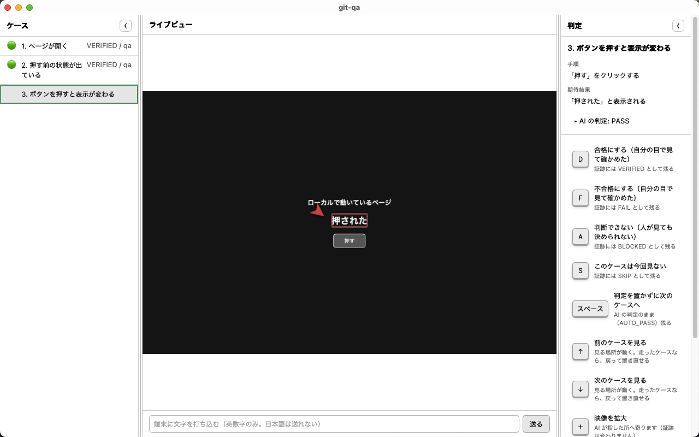
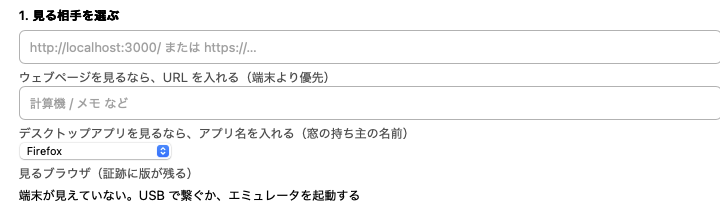
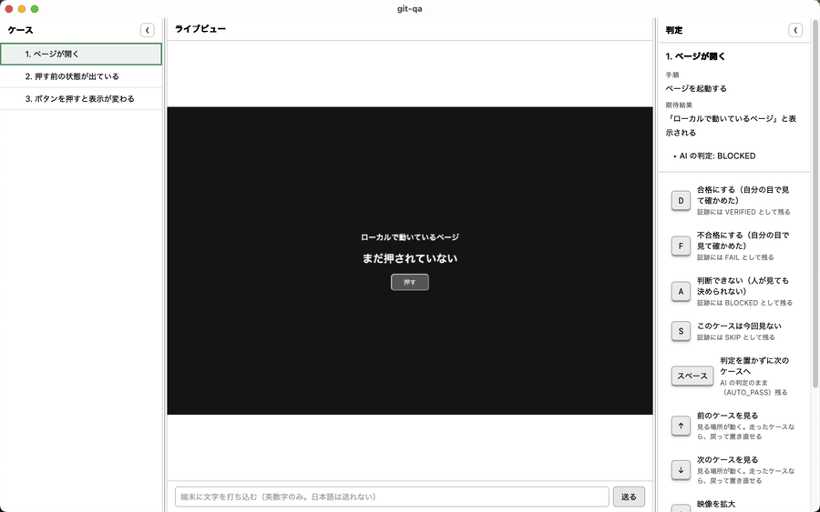

# git-qa

**Your test sheet runs itself. You watch, and sign off each case with one key.**

[日本語版はこちら / Japanese](./README.ja.md) · [Download](https://meta-taro.github.io/git-qa/)



*Left: the cases in your test sheet. Middle: the page, device or app, live, while the AI drives it —
the red marker is where it found the expected text. Right: one key per verdict — `D` pass, `F` fail.
Your handle goes into the evidence when you press it. (The UI is shown in Japanese; it also speaks English.)*

## When you would reach for it

**The release check nobody wants to click through again.**
You have a 30-row regression sheet for an Android app, a web page and a desktop app.
Instead of tapping through it by hand, the AI follows the sheet while you watch the live view
and press a key per case. You only stop to look closely where something changed or failed.

**"Who actually checked this?"**
A client, an auditor or your own team asks after an incident. The evidence answers:
each case says `VERIFIED` (a person looked and signed) or `AUTO_PASS` (the AI passed it, nobody looked),
with the name, the time, and the screen at that moment.

**An AI agent built the feature — now it should check it, on a real device.**
Over MCP, Claude Code (or any agent) can screenshot, read the screen, list what can be pressed and tap it,
on Android, web, desktop or iPhone. It can run the sheet unattended overnight (`--no-ui`);
in the morning you review the failures. **The pass is still yours to give.**

## Try it

1. Download the app from the [distribution page](https://meta-taro.github.io/git-qa/) (macOS, Windows x64 / ARM64) and install **Node 22+**
2. Open git-qa. Enter a handle (it goes into the evidence as "who looked"), pick what to look at —
   an `adb` device, a web page URL, or a desktop app by name — and a test sheet
3. Start, watch, and press `D` / `F` per case



A run, case by case — the AI runs each step, you press `D`, the case turns `VERIFIED / qa` and the next one starts:



A test sheet is a TSV you can write in any spreadsheet — samples are in [`sheets/`](./sheets/).
From source instead: `git clone … && pnpm install && pnpm app` (see [Install](#install)).

## Why it is built this way

This is *not* a tool for handing verification to an AI and letting it say
"everything passed." When something ships broken, the person is accountable —
"the AI did it" is not an answer anyone accepts.

So git-qa splits the work:

- **The AI operates** the device, the browser, or the desktop app, following a test sheet
- **The human watches, and places the verdict** with a single keystroke
- **The evidence records who saw what**, and when

### The vocabulary is the point

| Value | Meaning |
|---|---|
| `VERIFIED` | **A person put their name on it** |
| `AUTO_PASS` | The AI passed it. **Nobody looked** |
| `FAIL` | It failed |
| `BLOCKED` | Could not run — a precondition was not met |
| `SKIP` | Not run |

A plain `PASS` would collapse the first two into one value. **That collapse is
exactly what this tool exists to prevent.**

You *can* place `VERIFIED` without looking. **That is a feature, not a hole.**
The moment you press the key, your handle goes into the evidence. It is a
signature, not a lock. There is no anti-cheat machinery — adding it would make a
tool that exists to save effort expensive to use.

## What it can drive

| | |
|---|---|
| **Android devices** | Real devices and emulators over `adb` — tap, swipe, type |
| **Web pages** | Chrome / Edge / Firefox / Safari. Same viewport every run, so you can compare |
| **Desktop apps** | macOS (Accessibility + Vision OCR) and Windows (UI Automation) |
| **iPhone / iPad** | Watch, read and record over USB. **Tap, type, swipe and launch apps** through WebDriverAgent, which you sign and install on the device yourself ([guide](./docs/ios-press.md)). Tried on a real iPhone (iOS 17.5.1) |
| **Mobile browsers** | Android Chrome over `adb forward` + CDP. iOS Safari through the iPhone path above. **Not yet tried** |
| **From an AI agent** | Over MCP — screenshot, read the screen, **list the names you can press**, tap by name. Android, web, desktop, or iPhone / iPad |

## What evidence looks like

One folder per test run. **Commit the whole folder** if you want the test itself
under version control.

```
<workspace>/
  git-qa.json        marks this folder as one test project
  sheet.tsv          the test sheet
  runs/
    20260914-100000/
      run.json       verdicts, steps, who placed them and when
      case-001/
        screen.webp  the screen at the moment the verdict was placed
        screen.webm  video of the run — **only when asked for** (`--record`)
```

Nothing about your machine goes into the evidence: paths are relative to the
workspace, so the same run reads the same way on anyone's machine.

## Requirements

- **Node 22 or newer** — required. The app starts a runner process
- `adb` for Android, a browser for web — only if you use them
- `ffmpeg` / `cwebp` — optional. Without them, evidence is kept in the format it
  was captured in, uncompressed

## Install

Download from the [distribution page](https://meta-taro.github.io/git-qa/), or
run it from source:

```bash
git clone https://github.com/meta-taro/git-qa.git
cd git-qa
pnpm install
pnpm app
```

macOS builds are signed and notarized. **Windows builds are not signed** — you
will see "Windows protected your PC"; check the source before choosing *Run*.

To see what this machine can actually do — measured, not guessed:

```bash
pnpm doctor
```

The app also states its own version on the start screen ("This git-qa is
v0.2.0-beta.20"). **Paste that line into bug reports** — it decides which build
you are talking about. When a newer build exists, the same place says so; git-qa
never replaces itself.

## Status

**Beta.** Three products are using it. Rough edges are listed in each release's
notes, and **nothing fails silently** — where a step cannot run, it is recorded
as "a person needs to do this," not as a pass.

Bug reports and requests: [Issues](https://github.com/meta-taro/git-qa/issues).
**Please write them in your own words, right after you hit the problem.**
Summarizing loses the part that actually hurt.

## License

MIT — see [LICENSE](./LICENSE).
