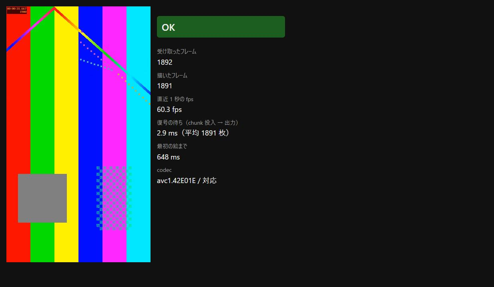

# ADR 0002 — ライブ映像の埋め込み方式

- 状態: 採用（Windows / macOS で実測。**Linux は未測定**）
- 日付: 2026-08-17（macOS の実測を 2026-09-01 に追記）
- 関連: Issue 003 / C4（ライブビューが主媒体）/ C24（Adapter は映像を出せることを型で必須）

## 決めること

**他プロセスの映像（scrcpy / ブラウザ）を、遅延なくウィンドウ内に出せるか。**

ここが成立しない方式で骨格を組むと後から直せない（Issue 003）。だから骨格の選定より先に、埋め込み方式を実測した。

## 選択肢

| 方式 | 内容 | 見立て |
|---|---|---|
| **A. ストリームを取り込んで自前で描く** | 生 H.264 を受け取り、アプリ内で復号して canvas に描く | 枠の中に自由に置ける。ケース一覧・判定欄と重ねられる |
| B. 子ウィンドウを重ねる | scrcpy のウィンドウを OS の機能でアプリの中に埋める | 復号は scrcpy 任せで速いが、**OS ごとに別実装**。重ね順・DPI・リサイズが個別に壊れる |
| C. 外部ウィンドウを並べる | scrcpy を別ウィンドウのまま横に置く | 実装は最小。ただし**人が 2 つのウィンドウを見比べることになる**。C4（ライブビューが主媒体）と噛み合わない |

## 実際に試したこと

**実機は無い**（adb / scrcpy が手元に無い）。そこで **ffmpeg で scrcpy と同じ形の出力を作って代わりにした。**

scrcpy が吐くのは「生 H.264（Annex-B）の 1 本のストリーム」で、これは ffmpeg で作れる。確かめたいのは端末との接続ではなく、**その映像を GUI の中に遅延なく出せるか**だけなので、出どころが実機である必要はない。

- スパイク: `spikes/live-view/`（`server.mjs` が ffmpeg を起動して HTTP chunked で流し、`index.html` が WebCodecs で復号して canvas に描く）
- 映像: `testsrc2` 720x1280 / 60fps。画面内に経過時間とフレーム番号が出るので、**送り手と受け手のズレが絵から読める**
- 測った環境: Windows 11 / Chromium 系ブラウザ（**Tauri が Windows で使う WebView2 と同じエンジン**）

### 結果（31 秒時点）

| 項目 | 値 |
|---|---|
| codec | `avc1.42E01E` / 対応 |
| 受け取り / 描画 | 1892 / 1891（**取りこぼしなし**） |
| fps | 60.3（送り手 60fps に追随） |
| 復号の待ち（chunk 投入 → 出力） | 2.9 ms |
| 最初の絵が出るまで | 648 ms |
| 送り手と受け手のフレーム差 | 開始直後 3 枚（約 50 ms）→ 31 秒後 9 枚（約 150 ms） |

**方式 A で足りる。**60fps を落とさず、遅れは 150 ms 以内に収まっている。人が画面を見て「今の操作でこうなった」と判断するには十分。

### 途中で踏んだこと（記録として残す）

最初の実装は 21 秒で 5118 枚を数え、復号器が落ちた。原因は **1 フレームが複数スライスに割れていた**こと（`-tune zerolatency` が x264 の sliced-threads を立てる）。「スライスが来た＝次のフレーム」と数えたので枚数が水増しされ、1 枚に満たない chunk を投げて復号器が落ちていた。

直し方は 2 つ入れた。

1. スライスの先頭かどうかを `first_mb_in_slice`（スライスヘッダ最初の ue(v)）で判定する。**割れていても境界を間違えない**
2. ffmpeg 側で `sliced-threads=0`。Android の MediaCodec（scrcpy の出どころ）は 1 フレーム 1 スライスなので、そちらに寄せた

**実機でも割れることはある**（端末・エンコーダ設定による）。1 は実装として残す。

## 決定

**方式 A（ストリームを取り込んで自前で描く）を採る。**

骨格は **Tauri**（Rust）とする。

- Windows では WebView2 ＝ Chromium で、**上記の実測がそのまま当てはまる**
- Rust 側でストリームの受け口（scrcpy / adb / ブラウザ）を持てる。Adapter の実装先として自然（C24）
- Electron に比べて配布物が小さい

## 追記（2026-09-01）— macOS / WKWebView で実測した

上の「覆すべき条件」の 1 つ目（macOS が未測定）を潰した。**開発機が Apple Silicon の Mac になったので測れるようになった。**

測ったのは **Tauri のウィンドウの中**（WKWebView）。上の Windows の測定は Chrome で行っており、
「Tauri のシェルの中では測っていない」という弱点も同時に潰している。

### 結果

| | Windows / Chromium | macOS / WKWebView |
|---|---|---|
| `avc1.42E01E` の対応 | 対応 | **対応** |
| 最初の絵まで | 648 ms | **103 ms** |
| 取りこぼし | 無し | **無し**（97 秒で 描画 5832 / 理想 5832） |
| 復号の待ち（動いている間の直近 60 枚平均） | 2.9 ms | **6.6〜17.2 ms** |

**macOS で WebCodecs の H.264 復号は使える。覆すべき条件の 1 つ目は成立しない。**

### 最初は 59 枚で止まった。原因はこちらのバグだった

最初の測定では **59 枚（ほぼ 1 秒）で `Decoder failure` が出て停止**した。Safari でも同じ枚数で
同じ止まり方をしたので、Tauri 固有ではなく WebKit 全体の挙動。

**原因はスパイクのアクセスユニット境界の判定漏れ。**ストリームは
`[前フレームの slice][SPS][PPS][IDR slice]` の順で来るが、SPS / PPS を「スライスではない」として
**直前のユニットへ足していた。**結果、前フレームの chunk の末尾にパラメータセットがぶら下がる。

- **Chromium はこれを通す**（Windows で 31 秒間問題が出なかったのはこのため）
- **WebKit は通さない**

パラメータセット（AUD 9 / SEI 6 / SPS 7 / PPS 8）がスライスの後に来たら、そこをアクセスユニットの
境界として切るように直した。**直した後は 97 秒間で 1 度も落ちず、取りこぼしも無い。**

**エンコーダ側の設定に頼らず、受け手が正しく境界を判定する**という点で、既に入れていた
`first_mb_in_slice` による先頭スライス判定と同じ性質の修正。実機の scrcpy でも同じことが起きうる。

### 計測中の周期的な停止は、画面がロックされていたため

計測中、**`document.hidden` が全ての報告で true** だった（ウィンドウを `alwaysOnTop` + `focus` で
開いても変わらない）。WebKit はページが隠れているとタイマーを間引くため、**約 20 秒ごとに 14 秒前後の
停止**が周期的に出ていた。停止を跨いだフレームの遅延は 905 ms まで跳ねる。

**Tauri 固有かを Safari で切り分けた結果、Safari でも同じく `hidden: true` になった。**
そのうえで最前面のアプリを見たら `loginwindow` だった。**画面がロックされていた。**
ロック中は全てのウィンドウが occluded になるので、webview がタイマーを間引くのは正しい挙動。

**製品側のリスクではない。**Tauri でも Safari でも同じで、原因は計測環境。

ただし**このため、遅延の数字は「動いている区間の値」であって、通しの平均ではない。**
上の表の 6.6〜17.2 ms は、間引きを跨いでいない区間の直近 60 枚平均。

**残っていること**: 画面のロックを解き、ウィンドウを見える状態にしたうえでの通し計測。
**人が画面の前にいる必要がある**（product-baseline §29）。engine の対応可否という一番大きな問いは
既に決着しているので、これは精度の話。

---

## この決定の弱いところ（隠さない）

- ~~**Chrome で測っており、Tauri の WebView2 シェルの中では測っていない。**~~ → macOS では **Tauri のウィンドウの中で測った**（2026-09-01 の追記）。**Windows の WebView2 シェルの中では依然として測っていない**
- ~~**macOS（WKWebView）/ Linux（WebKitGTK）は未測定。**~~ → **macOS は実測済**（2026-09-01 の追記）。**Linux（WebKitGTK）は未測定のまま**
- **macOS の遅延は、画面ロック中の計測。**間引きを跨いでいない区間の値であって、通しの平均ではない。**画面を見える状態にしての計測は未実施**（追記の末尾）
- **実機の scrcpy で測っていない。**ffmpeg は形を似せた代役であって、端末側のエンコーダ遅延・USB / Wi-Fi の遅延は含まれていない
- **送り手と受け手のフレーム差が 30 秒で 3 → 9 枚に広がった。**送り手の刻み（ffmpeg の `-re`）のズレか、受け手が溜め込んでいるのかを切り分けていない。**長時間の実行で無視できない遅れになる可能性がある**

## これを覆すべき条件

- ~~macOS / Linux で WebCodecs の H.264 復号が使えない、または実用にならない遅延だった~~ → **macOS は 2026-09-01 に実測し、使えることを確認した**（上の追記）。**Linux は未測定のまま**
- 実機の scrcpy を繋いだとき、遅れが操作の判断を妨げる大きさになった
- フレーム差の広がりが止まらず、長時間の検証で映像と操作が合わなくなった
